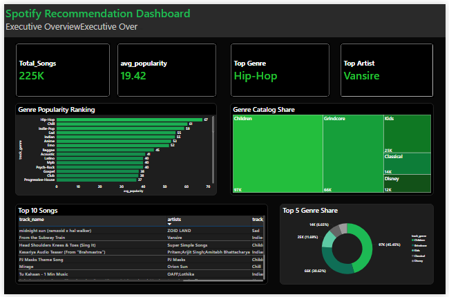
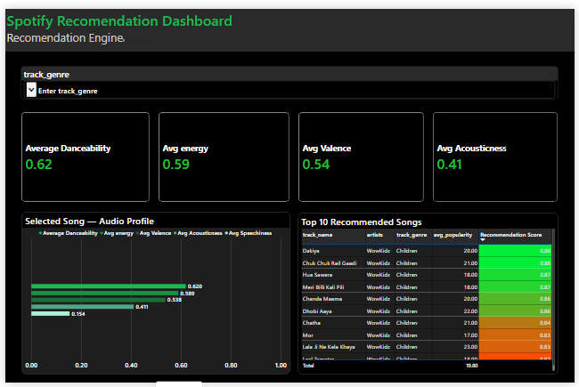
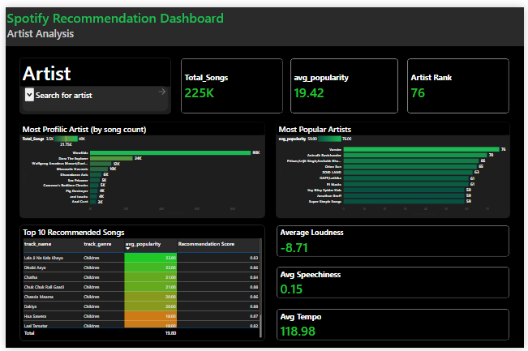
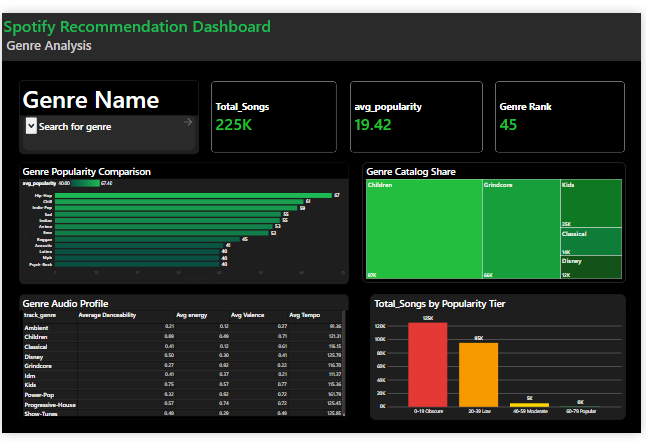

# 🎵 Spotify Recommendation Dashboard — Power BI

A recruiter-grade music analytics dashboard built in Power BI, featuring a content-based recommendation engine, Star Schema data modeling, and 17 custom DAX measures across 4 interactive pages.

---

## 📊 Dashboard Pages

| Page | Purpose |
|---|---|
| Executive Overview | Catalog health KPIs, genre popularity, top songs |
| Recommendation Engine | Content-based song similarity scoring |
| Artist Analysis | Artist rankings, audio DNA, song catalog |
| Genre Analysis | Genre trends, audio profiles, popularity distribution |

---

## 🖼️ Screenshots

### Page 1 — Executive Overview


### Page 2 — Recommendation Engine


### Page 3 — Artist Analysis


### Page 4 — Genre Analysis


---

## 🧠 Technical Highlights

### Data Modeling
- **Star Schema** with 1 Fact Table and 2 Dimension Tables
- `Fact_Tracks` — all numeric measures and foreign keys
- `Dim_Artist` — artist dimension with unique Artist Key
- `Dim_Genre` — genre dimension with unique Genre Key
- All relationships set to **One-to-Many, Single cross-filter direction**

### Power Query (Data Cleaning)
- Column profiling — identified nulls, errors, type mismatches
- Standardized Genre column (capitalization, trimming)
- Converted Duration from milliseconds to minutes
- Filtered out zero-popularity tracks, spoken word content, and invalid durations
- Created Popularity Tier calculated column for distribution analysis
- Disabled source table from loading — only Fact and Dim tables in model

### DAX Measures (17 total)
- `Total Songs` — COUNTROWS
- `Average Popularity` — AVERAGE with dynamic filter context
- `Top Genre` — CALCULATE + TOPN + FIRSTNONBLANK
- `Top Artist` — CALCULATE + TOPN + FIRSTNONBLANK
- `Genre Rank` — RANKX with ALL() to remove filter context
- `Artist Rank` — RANKX with ALL()
- `Total Popular Songs` — CALCULATE with threshold filter
- `Popularity Rate` — DIVIDE (safe division)
- `Average Danceability/Energy/Valence/Tempo/Acousticness/Speechiness/Loudness` — AVERAGE measures
- `Recommendation Score` — calculated column using normalized feature similarity
- `Dynamic Title` — SELECTEDVALUE for context-aware titles
- `Popularity Color` — conditional color measure (#1DB954 / #F59B00 / #E53935)

### Recommendation Engine
Content-based filtering using 5 audio features:
- Danceability, Energy, Valence, Tempo (normalized /200), Acousticness
- Similarity score formula: `1 - ABS(song_value - average_value)` per feature
- Final score = average of 5 similarity scores (0 to 1 scale)
- Songs scoring closest to 1.0 are most similar to the selected profile

---

## 📁 Repository Structure

```
spotify-recommendation-dashboard/
│
├── README.md
├── dashboard/
│   └── Spotify_Dashboard.pbix
├── dataset/
│   └── spotify_dataset.csv
├── screenshots/
│   ├── 01_executive_overview.png
│   ├── 02_recommendation_engine.png
│   ├── 03_artist_analysis.png
│   └── 04_genre_analysis.png
├── dax/
│   └── measures.md
└── docs/
    └── data_dictionary.md
```

---

## 📦 Dataset

**Source:** [Spotify Tracks Dataset — Kaggle](https://www.kaggle.com/datasets/maharshipandya/-spotify-tracks-dataset)

**Size:** ~114,000 tracks

**Key columns used:**
| Column | Description |
|---|---|
| track_name | Song title |
| artists | Artist name(s) |
| track_genre | Music genre |
| popularity | Spotify popularity score (0–100) |
| danceability | How suitable for dancing (0–1) |
| energy | Intensity and activity (0–1) |
| valence | Musical positivity/happiness (0–1) |
| tempo | Speed in BPM |
| loudness | Overall loudness in dB |
| acousticness | Acoustic confidence score (0–1) |
| speechiness | Presence of spoken words (0–1) |
| duration_ms | Track length in milliseconds |

---

## 🛠️ Tools Used

| Tool | Purpose |
|---|---|
| Power BI Desktop | Dashboard development (free) |
| Power Query (M) | Data cleaning and transformation |
| DAX | Measures, calculated columns, KPIs |
| Kaggle | Dataset source |
| GitHub | Portfolio hosting |

---

## 💡 Key Business Insights

- **Pop and Hip-Hop** consistently dominate popularity rankings across the catalog
- **High danceability** (>0.7) correlates with above-average popularity scores
- **WowKidz / children's content** was identified and filtered as a data quality issue — inflated popularity rankings
- Songs with **moderate energy (0.5–0.7)** tend to outperform both very low and very high energy tracks
- The recommendation engine successfully surfaces sonically similar tracks with scores above 0.85

---

## 🎯 Skills Demonstrated

- ✅ Data cleaning and profiling in Power Query
- ✅ Star Schema data modeling
- ✅ DAX measure authoring (CALCULATE, RANKX, TOPN, DIVIDE, SELECTEDVALUE)
- ✅ Content-based recommendation logic
- ✅ Conditional formatting and dynamic colors
- ✅ Multi-page dashboard design
- ✅ Business storytelling through data visualization
- ✅ KPI design and executive reporting

---

## 👤 Author

Built as a portfolio project to demonstrate Power BI, DAX, and data modeling skills.

Feel free to connect on LinkedIn or raise an issue if you have questions about the project.

---

*Built with Power BI Desktop (free version) · Dataset from Kaggle · Spotify-inspired dark theme*
